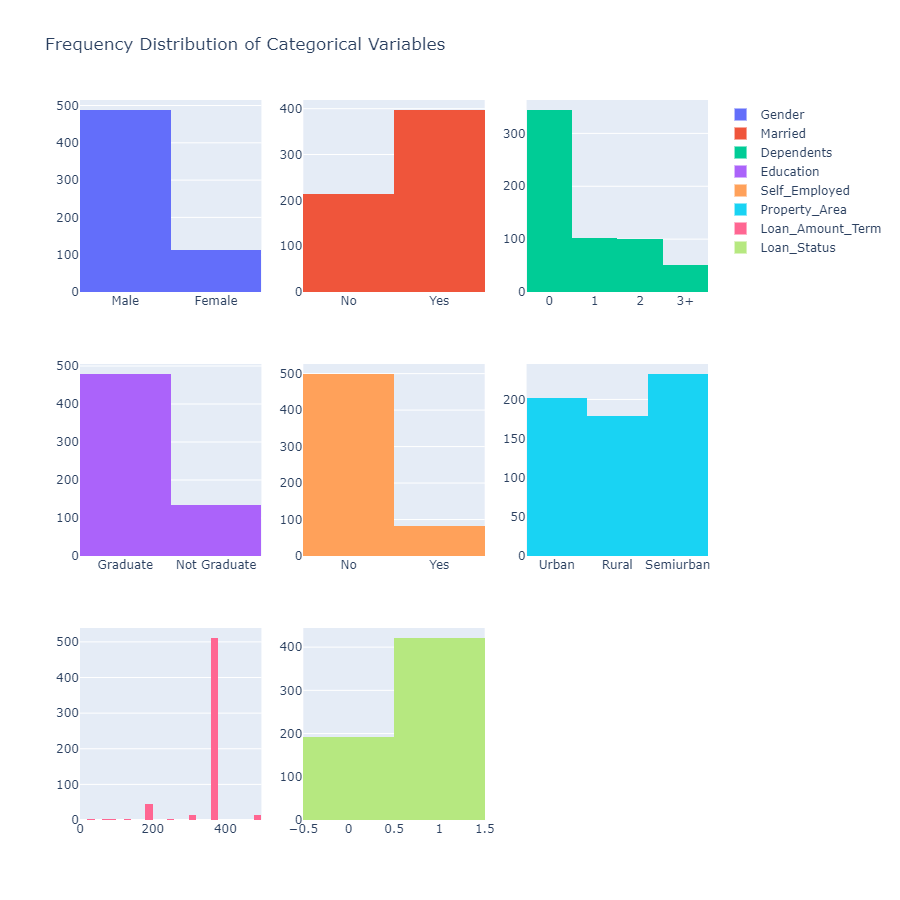
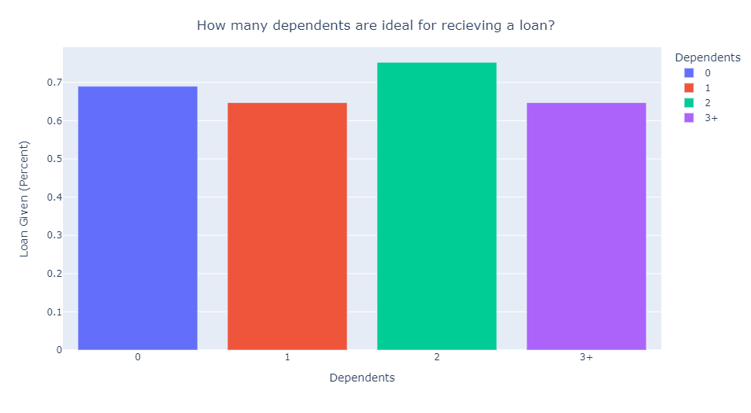
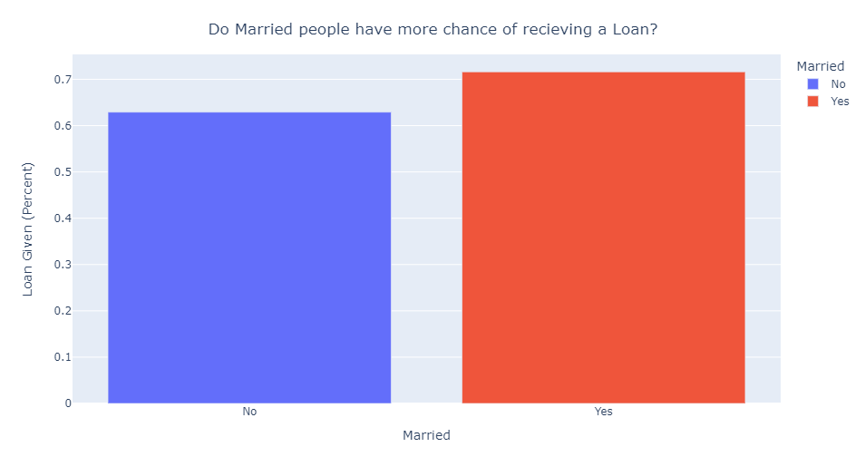
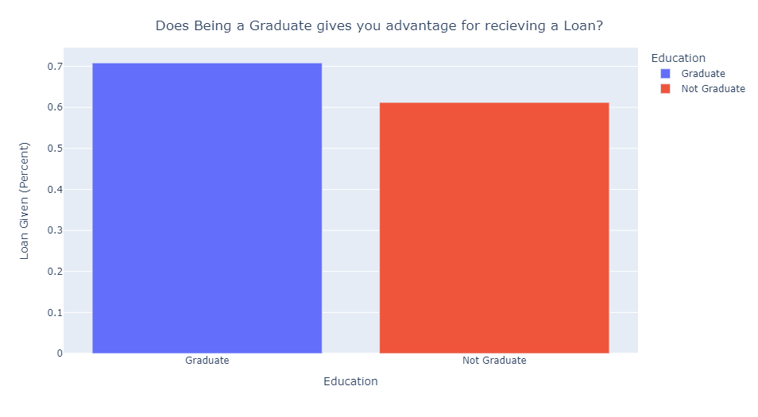

# Loan Eligibility Prediction
 

This is a challenge on [Analytics Vidhya Datahack Competition](https://datahack.analyticsvidhya.com/contest/practice-problem-loan-prediction-iii/)  

## Problem statement
Dream Housing Finance company deals in all home loans. They have presence across all urban, semi urban and rural 
areas. Customers first apply for a home loan after that company validates the customer eligibility for the loan. 
Company wants to automate the loan eligibility process based on customer detail provided while filling an online 
application form. These details are Gender, Marital Status, Education, Number of Dependents, Income, Loan Amount, 
Credit History and others. To automate this process, they have given a problem to identify the customers segments, 
those are eligible for loan amount so that they can specifically target these customers.

### Business Problem Solved:
<b>Banks: Automating the loan approval system</b>

## Results From E.D.A
### Data Distribution
 

 

### Ideal Number of Dependents
 
<b>People with 2 Dependents have recieved most loans</b>

### Marriage Status Effect on Loan Approval
 
<b>71% Married people have recieved the loan whereas 63% Non-Married people have recieved the loan</b>

### Graduate or Not-Graduate
 
<b>Graduates are more likely to recieve loans as compared to Non Graduates</b>

### Ideal Property Area
 
<b>People with property area as Semi-Urban have recieved the most loans</b>

## Process Followed

- First, Imputed the null values using KNN imputer.  
- Then, Used Smote Tomek to handle the Class Imbalance.  
- Using Feature engineering Techniques, encoded categorical variables using one hot encoding also derived 2 new 
  features.  
- Model Selection - checked the cross-val score for 5 folds for all the classification models.  
- Random Forest and Cat Boost gave the best results. Then, Hypertuned the RandomForest Classifier.  
- Finally, used Voting Classifier with soft voting and model used Random Forest Classifier and Cat Boost.  
- Used streamlit(app.py) for providing the user interface

## Results Obtained

### Confusion Matrix
 

### Classification Report

                 precision    recall  f1-score   support

           0       0.99      0.97      0.98       346
           1       0.97      0.99      0.98       346

    accuracy                           0.98       692
    macro avg       0.98      0.98     0.98       692
    weighted avg    0.98      0.98     0.98       692

### ROC - AUC Curve
  

Checkout the notebooks for more detailed understanding.
